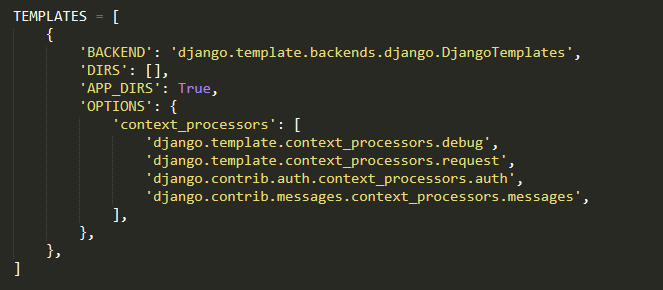
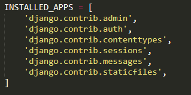

## Django Templates

A template in Django is basically written in HTML, CSS and Javascript in an .html file. Django framework efficiently handles and generates dynamically HTML web pages that are visible to end-user.Django mainly functions with a backend so, in order to provide frontend and provide a layout to our website, we use templates.

<ul>
<li>Django provides a convenient way to generate dynamic HTML pages by using its template system,creatively called the Django template language (DTL)</li>
<li>A template consists of static parts of the desired HTML output as well as some special syntax describing how dynamic content will be inserted.</li>
</ul>

### Why Django Template ?
<ul>
<li>In HTML file, we can't write python code because the code is only interpreted by python interpreter not the browser. We know that HTML is a static markup language, while Python is a dynamic programming language.</li>
<li>Django template engine is used to separate the design from the python code and allows us to build dynamic web pages.</li>
</ul>

### Django Template Configuration

To Configure the template system we have to provide some entries in settings.py file.

Here, we mentioned that our template directory name is templates. By default, DjangoTemplates looks for a templates subdirectory in each of the INSTALLED_APPS.

we have to install some apps before the starting the project and created app name  must be placed in Installed_Apps.

### Django Templates Creation Procedure

 First create a Folder <b>Templates</b> inside the project app i.e firstapp
 

Next create a template <b>index.html</b> inside <b>Tempaltes</b> Folder.

