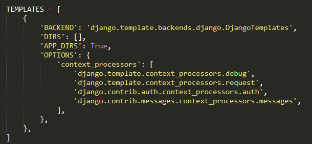
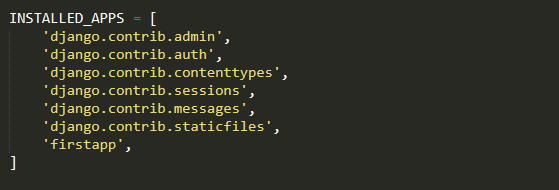
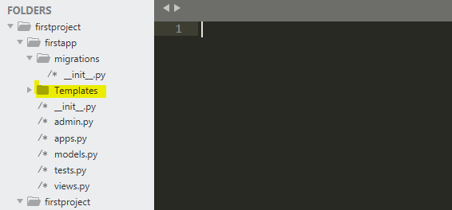
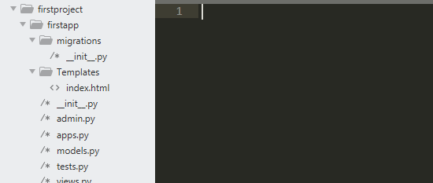
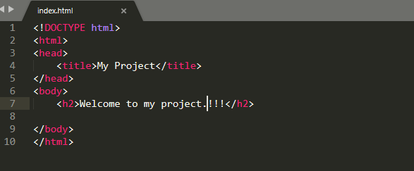
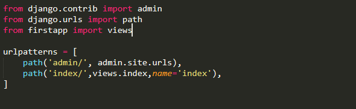
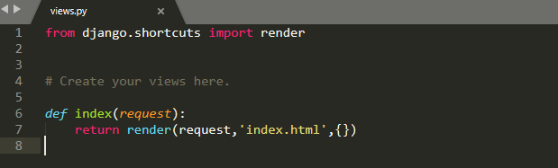
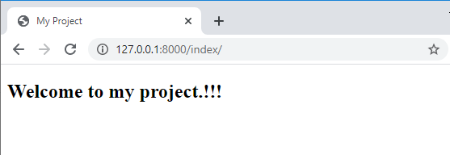
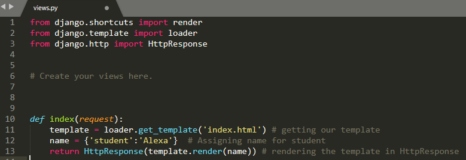
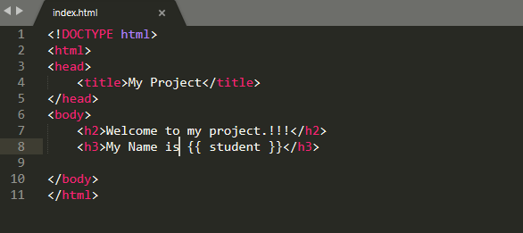

## Django Templates
<p>A template in Django is basically written in HTML, CSS and Javascript in an .html file. Django framework efficiently handles and generates dynamically HTML web pages that are visible to end-user.Django mainly functions with a backend so, in order to provide frontend and provide a layout to our website, we use templates.</p>
<ul>
<li>Django provides a convenient way to generate dynamic HTML pages by using its template system,creatively called the Django template language (DTL)</li>
<li>A template consists of static parts of the desired HTML output as well as some special syntax describing how dynamic content will be inserted.</li>
</ul>

### Why Django Template ?
<ul>
<li>In HTML file, we can't write python code because the code is only interpreted by python interpreter not the browser. We know that HTML is a static markup language, while Python is a dynamic programming language.</li>
<li>Django template engine is used to separate the design from the python code and allows us to build dynamic web pages.</li>
</ul>

### Django Template Configuration

<p>To Configure the template system we have to provide some entries in settings.py file.</p>

<p>Here, we mentioned that our template directory name is templates. By default, DjangoTemplates looks for a templates subdirectory in each of the INSTALLED_APPS.</p>

<p>we have to install some apps before the starting the project and created app name  must be placed in Installed_Apps.</p>



### Django Templates Creation Procedure

<p> First create a Folder <b>Templates</b> inside the project app i.e firstapp.</p> 



<p>Next create a template <b>index.html</b> inside <b>Tempaltes</b> Folder.</p>



<p>After creating a template we have to write a code in index.html.</p>

<p>Tempalte <b>index.html</b> contains the code.</p>



<p>To Load or render our template need a view and url mapped to that view.Let's begin creating urls.py and views.py.</p>

<p>Mapping <b>index.html</b> to <b>urls.py</b><p> 



<p> From <b>urls.py</b> mapping to <b>views.py</b>.</p>



<p>After mapping all these files we have to run the server,To run server we have to open our project directory and open command promt in that we have to use the command i.e <b>python manage.py runserver.</b></p>

<p>The output will appears like this</p>



<p> In that ouput we can see that at top of the page we have the title i.e <b>My Project</b> and also body part which we have written in the <b>index.html</b> page.</p>
     
### Django Template Language(DTL)

<p>This is one of most important facility provided by Django Templates. A Django template is a text document or a Python string marked-up using the Django template language.Django template uses its own syntax to deal with variable, tags, expressions etc. A template is rendered with a context which is used to get value at a web page.</p>
<ul>
<li>Main characterisitcs of django Template language are Variables, Tags, Filters and Comments.</li>
<li>similarly, we can used various other conditions such as if, else, if-else, empty, etc.</li>
</ul>

#### Variables

<p>Variables associated with a context can be accessed by {{}},It is a dict-like object mapping keys to values. The context object we sent from the view can be accesses in template using variables of Django Template.</p>

##### syntax

``` django
{{ variable_name }}
```
##### Example

```django
My name is {{ name }}.
My name is Alexa.
```
### Django Variable Example
<ul>
<li><b>views.py</b> code</li>
</ul>

<ul>
<li><b>index.html</b> code</li>
</ul>

<ul>
<li>After completing these process run the server then output will appear like this.</li>
</ul>


#### Tags

<p>Tags provide arbitrary logic in the rendering process.For example, a tag can output content, serve as a control structure e.g. an "if" statement or a "for" loop, grab content from a database etc.</p>

<p>Tags are surrounded by  braces.</p>

##### Syntax

```django

```
##### Example 

```django

```
#### Filters

<p>Filters transform the values of variables and tag arguments.</p>

<p>They look like this:</p>

```django
{{ APSSDC|title }}
```
<p>With a context of <b>{'APSSDC': 'AndhraPradesh State Skill Development Corporation'}</b>, this template renders to:</p>

```django
AndhraPradesh State Skill Development Corporation
```

Some filters take an argument:

```django
{{ my_date|date:"Y-m-d" }}
```

#### Comments

<p>Comments look like this:</p>

```django
{# this won't be rendered #}
```
<ul>
<li>A  tag provides multi-line comments.</li>
<li>Ignores everything between  and . An optional note may be inserted between these tags.</li>
</ul>

## Django Static Files Handling

<p>Today, websites have become much more interactive than ever. They contain tons of CSS and JavaScript Code to make our experience smoother.</p>

<p>There are lots of graphics involved on websites too. Our Python Tutorials Home Page is the best example. There are outputs and screenshots and these images are important for the blog. So, from this, we can state that there are multiple files on a webpage.</p>

<p>Important point is that none of these files can be modified by the server. It means these files are transmitted as it is, without any modification.</p>


 


