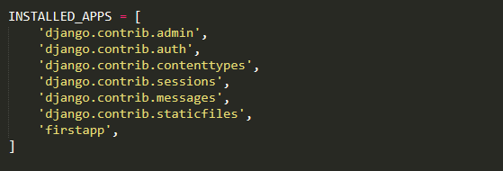

## Django Static Files Handling

<p>Today, websites have become much more interactive than ever. They contain tons of CSS and JavaScript Code to make our experience smoother.</p>

<p>There are lots of graphics involved on websites too. Our Python Tutorials Home Page is the best example. There are outputs and screenshots and these images are important for the blog. So, from this, we can state that there are multiple files on a webpage.</p>

<p>Important point is that <i>none of these files can be modified by the server</i>. It means these files are transmitted as it is, without any modification.</p>

### What are Static files?

<i>Static files are those files which can not be processed, generated or modified by the server.</i>

<p>There is a catch here. Images, JavaScript files, etc are types of content or static files. Static files contain all kinds of file types – from .mpeg, .jpeg to .pdf, etc.There is a simple concept of working with static files. When a user requests for a webpage, the server will generate the HTML. Then the server will collect all the corresponding static files related to that page. Lastly, this whole data is served.</p>

<p>You can see that process in this flow-diagram. Also, we can say that static websites are much faster than dynamic websites.</p>


#### Benefits of Static Files
<ul>
<li><b>They are static:</b> These files don’t change until the developer replace them with a new one. Thus, the server just fetches them from the disk, taking a minimum amount of time.</li>
<li><b>Static files are easier to cache:</b> They don’t change and are not modified by the server. That makes the performance faster.</li>
  <li><b>Static files are energy efficient:</b> Static files are fetched from the disk when required. They require no processing which saves the processing overhead and website response becomes fast.</li>
</ul>

## Django Static (CSS, JavaScript, images) Configuration
<ul>
<li>Include the <b>django.contrib.staticfiles</b> in <b>INSTALLED_APPS</b>.</li>
</ul>

<ul>
<li>Define STATIC_URL in settings.py file as given below.</li>
</ul>

```python
STATIC_URL = '/static/'  
```

<ul>
<li>Load static files in the templates by using the below expression.</li>
</ul>

```html
  
```

<ul>
<li>Store all images, JavaScript, CSS files in a static folder of the application. First create a directory static, store the files inside it.</li>
</ul>


